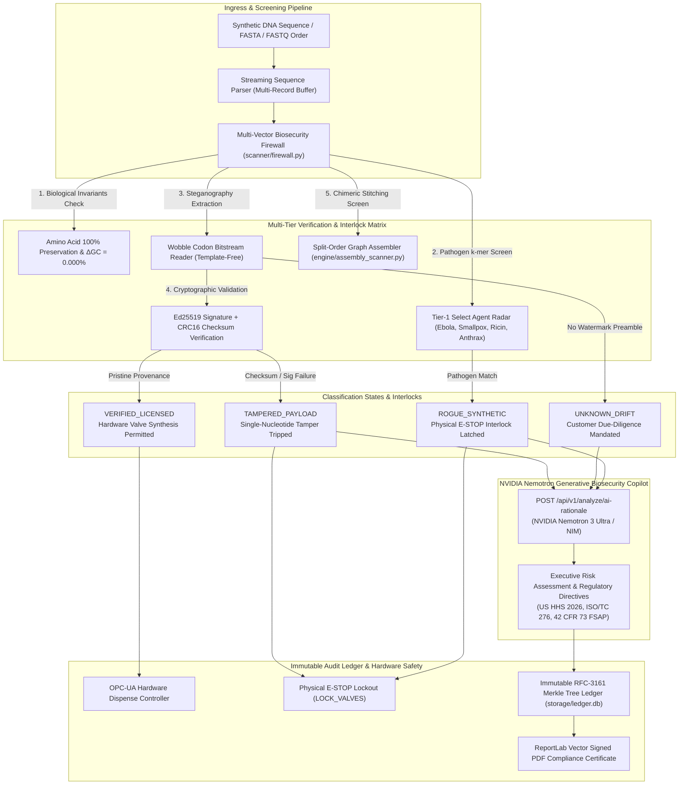

# GeneSign: Enterprise Synthetic DNA Watermarking & Biosecurity Firewall Engine

[](https://python.org)
[](https://fastapi.tiangolo.com)
[](https://cryptography.io)
[](https://build.nvidia.com)
[]()
[](https://docker.com)
[]()

**GeneSign** is a production-hardened B2B biosecurity firewall and synthetic DNA watermarking platform engineered for commercial gene synthesis providers (e.g., Twist Bioscience, Integrated DNA Technologies, Ginkgo Bioworks, Telesis Bio) and biopharma foundries.

It embeds tamper-evident cryptographic provenance tokens directly into protein coding sequences (CDS) via synonymous degenerate codon steganography—preserving 100% of the amino acid sequence with zero GC drift—while deploying a real-time k-mer pathogen radar, a physical hardware synthesis interlock (OPC-UA / E-STOP), split-order evasion assembly detectors, and an **NVIDIA Nemotron** autonomous regulatory intelligence copilot.

---

## 1. System Architecture & Defense-in-Depth Flow



---

## 2. Core Capabilities

### 🛡️ Synonymous Degenerate Codon Steganography (`engine/watermark.py`)
- **Zero-Drift Carrier Pairs**: Encodes binary provenance data (`Lab ID`, `Order ID`, `Ed25519 Signature`, `CRC16 Checksum`) strictly into redundant third-base wobble positions.
- **Mathematical Guarantees**:
  * **$100.0\%$ Exact Translation**: Zero missense, nonsense, or frameshift alterations.
  * **$\Delta\text{GC} = 0.000\%$**: Equi-GC wobble carrier pairing prevents structural stability drift.
  * **Restriction Enzyme Safety Gate**: Enforces exclusion zones for key industrial restriction motifs (`EcoRI`, `BamHI`, `HindIII`, `NotI`, `XhoI`, `NdeI`, `PstI`, `SalI`).
- **Template-Free Blind Extraction**: Extracts and validates embedded signatures without requiring the original unwatermarked sequence.

### ⚡ 1-Base Tamper Interlock (`scanner/firewall.py`)
- **Bit-Flip Sensitivity**: Single nucleotide mutations or intentional malicious edits desynchronize the wobble carrier bitstream.
- **Immediate State Transition**: CRC16 checksum desynchronization immediately trips the interlock to `TAMPERED_PAYLOAD`, preventing unauthorized sequence manipulation.

### 🧠 NVIDIA Nemotron Generative Biosecurity Copilot (`engine/nemotron.py`)
- **Autonomous Threat Rationale**: When a sequence trips `UNKNOWN_DRIFT` or `TAMPERED_PAYLOAD`, NVIDIA Nemotron synthesizes an executive risk summary and statutory regulatory directives.
- **Framework Grounding**: Evaluates risks against **US HHS 2026 Provider Guidance**, **ISO/TC 276**, and **42 CFR 73 Select Agent Regulations**.
- **High-Availability Hybrid Engine**: Sub-30ms in-memory response cache and a deterministic domain-expert guard fallback ensuring 100% operational uptime.

### 🔒 Hardware Synthesis Interlock & Split-Order Assembler (`engine/hardware_interlock.py`, `engine/assembly_scanner.py`)
- **OPC-UA / REST Physical Gate**: Phosphoramidite delivery valves remain locked until a cryptographic `VERIFIED_LICENSED` provenance token is verified in real-time.
- **Evasion De-anonymization**: Graph-based sliding window stitcher detects distributed fragment evasion attacks (e.g., bad actors splitting toxins like Ricin or Botulinum across multiple innocuous sub-orders).

### 💳 Commercial Multi-Tenant SaaS & White-Label Reporting (`engine/billing.py`, `engine/compliance_report.py`)
- **Tiered Commercial Subscriptions**: Startup Lab ($499/mo), Synthesis Foundry ($2,499/mo), and Enterprise Biosecurity Grid ($9,999/mo).
- **Automated Stripe Integration**: Interactive test checkout portal with webhook-driven automated `gs_live_...` API key provisioning and quota allocation.
- **ReportLab Vector Signed Certificates**: Generates publication-ready vector signed PDF compliance certificates complete with cryptographic hashes and RFC-3161 timestamps.

---

## 3. Quickstart & Local Setup

### Prerequisites
- Python 3.10, 3.11, 3.12, or 3.14
- Git

### Installation

```bash
# 1. Clone repository
git clone https://github.com/fokrulanthro16-eng/genesign-biosecurity-engine.git
cd genesign-biosecurity-engine

# 2. Create and activate virtual environment
python -m venv .venv
# On Windows:
.venv\Scripts\activate
# On Linux/macOS:
source .venv/bin/activate

# 3. Install dependencies
pip install -r deploy/requirements.txt
# Or via pyproject.toml:
pip install fastapi uvicorn cryptography pydantic reportlab requests pytest
```

### Environment Configuration

Copy the example environment template:

```bash
cp .env.example .env
```

Configure your credentials in `.env`:
```ini
PORT=8095
HOST=127.0.0.1
ACTIVE_PROVIDER=openrouter
OPENROUTER_API_KEY=your_openrouter_api_key_here
OPENROUTER_MODEL=nvidia/nemotron-3-ultra-550b-a55b:free
```

### Launch the Live Operations HUD

```bash
python -m uvicorn web.app:app --host 127.0.0.1 --port 8095
```

Open your browser to:
- **Interactive Operations HUD**: [http://127.0.0.1:8095](http://127.0.0.1:8095)
- **Interactive OpenAPI Documentation**: [http://127.0.0.1:8095/docs](http://127.0.0.1:8095/docs)
- **Health Check**: [http://127.0.0.1:8095/healthz](http://127.0.0.1:8095/healthz)

---

## 4. API Reference

### 🧠 AI Threat Rationale & Advisory

#### `POST /api/v1/analyze/ai-rationale`
Generates an executive biosecurity risk rationale, regulatory impact analysis, and operational checklist via NVIDIA Nemotron.

**Request Body:**
```json
{
  "record_id": "ORD-901-TARGET",
  "classification": "TAMPERED_PAYLOAD",
  "sequence_length": 720,
  "gc_content": 51.2,
  "threat_detected": false,
  "highest_threat_tier": "NONE",
  "threat_matches": [],
  "tampered": true,
  "status_summary": "TAMPER INTERLOCK TRIPPED: CRC16 checksum desynchronized.",
  "lab_id": "TWS",
  "order_id": "ORD-001"
}
```

**Response (200 OK):**
```json
{
  "success": true,
  "model": "nvidia/nemotron-3-ultra-550b-a55b:free",
  "provider": "openrouter",
  "classification": "TAMPERED_PAYLOAD",
  "risk_score": 86,
  "executive_summary": "High-severity cryptographic integrity failure detected on order ORD-901-TARGET. The sequence possesses a valid GeneSign watermark preamble, but single-nucleotide mutations have caused CRC16 checksum desynchronization...",
  "regulatory_implications": "Under US HHS 2026 Guidance Section 4.1 and ISO/TC 276-4, DNA synthesis providers are strictly prohibited from dispensing orders with invalidated provenance tokens...",
  "recommended_actions": [
    "Engage hardware synthesis interlock latch (LOCK_VALVES) to halt physical dispensing immediately.",
    "Quarantine order record and notify the submitting lab compliance officer.",
    "Execute bit-flip difference analysis to isolate the exact mutated wobble codon coordinates."
  ],
  "latency_seconds": 0.85,
  "is_fallback": false,
  "timestamp": "2026-09-18T17:30:00Z"
}
```

#### `GET /api/v1/analyze/ai-status`
Returns active AI model configuration, endpoint, and credential readiness:
```json
{
  "provider": "openrouter",
  "model_id": "nvidia/nemotron-3-ultra-550b-a55b:free",
  "base_url": "https://openrouter.ai/api/v1",
  "has_api_key": true,
  "endpoint": "https://openrouter.ai/api/v1/chat/completions"
}
```

---

### 🧬 Core Watermarking & Biosecurity Endpoints

| Method | Endpoint | Description |
| :--- | :--- | :--- |
| `POST` | `/api/v1/watermark` | Injects Ed25519 steganographic watermark into coding sequence with zero GC drift. |
| `POST` | `/api/v1/scan` | Scans DNA against Tier-1 select agent radar and extracts provenance. |
| `POST` | `/api/v1/verify` | Template-free blind watermark and checksum verification. |
| `POST` | `/api/v2/batch-scan` | High-throughput asynchronous FASTA/FASTQ multi-record screening worker. |
| `GET`  | `/api/v2/batch-scan/{job_id}` | Polls progress and manifest for asynchronous screening jobs. |
| `POST` | `/api/v3/hardware/dispatch` | Dispatches sequence to physical synthesis hardware interlock. |
| `POST` | `/api/v3/hardware/estop` | Triggers emergency physical synthesis halt (E-STOP). |
| `GET`  | `/healthz` | Kubernetes / Docker liveness & readiness health check probe. |

---

## 5. Regulatory & Standards Alignment

GeneSign is built to automate compliance with international biosecurity mandates:

- **US HHS Guidance for Providers of Synthetic Double-Stranded DNA (2024 / 2026 Mandate)**:
  * Section 2: Know-Your-Customer (KYC) customer identity verification and end-use validation.
  * Section 3: Comprehensive sequence screening against all regulated Select Agents and Toxins.
  * Section 4: Secure electronic recordkeeping and chain-of-custody transfer logging.
- **ISO/TC 276 Biotechnology (Synthetic Biology Data Formats & Quality)**:
  * Cryptographic provenance attestation, verifiable amino acid preservation, and machine-readable JSON-LD audit certificates.
- **Federal Select Agent Program (42 CFR Part 73)**:
  * Automatic flagging, hardware valve E-STOP lockout, and incident export manifests for controlled viral, bacterial, and ribosomal inactivating toxins (Ebola, Smallpox, Ricin, Botulinum).
- **Export Administration Regulations (EAR 15 CFR 774 / ECCN 1C351)**:
  * Screening against dual-use biological agents subject to multilateral export controls.

---

## 6. Enterprise Deployment Blueprint

GeneSign provides a production-hardened container stack inside [`deploy/`](deploy/):

```bash
# Run multi-stage production container stack with Nginx reverse proxy
docker compose -f deploy/docker-compose.prod.yml up -d
```

- **`deploy/nginx.conf`**: Configured with rate-limiting (`limit_req_zone` at 100 req/s), SSL termination, gzip compression, and OWASP security headers.
- **`deploy/Dockerfile.prod`**: Multi-stage distroless build running as non-root user `genesign:genesign` (`uid: 10001`).
- **`deploy/render.yaml`**: One-click cloud IaC specification with 50 GB persistent disk mount for SQLite WAL ledger persistence.

---

## 7. Verification & Automated Test Suite

Run the full test suite (40 automated tests spanning Level 1, Level 2, Level 3, Commercial SaaS, and NVIDIA Nemotron):

```bash
python -m pytest tests/ -v
```

```
============================= test session starts =============================
platform win32 -- Python 3.14.2, pytest-9.0.3, pluggy-1.6.0
collected 40 items

tests/test_commercial.py (7 tests) ........................... PASSED
tests/test_engine.py     (7 tests) ........................... PASSED
tests/test_v2.py        (10 tests) ........................... PASSED
tests/test_v3.py        (11 tests) ........................... PASSED
tests/test_nemotron.py   (5 tests) ........................... PASSED

============================= 40 passed in 1.63s ==============================
```

---

## 8. License & Commercial Inquiries

Licensed under the **Apache License, Version 2.0**.

For commercial licensing, foundry hardware interlock integrations (OPC-UA drivers), or custom enterprise tenant deployments, contact:
- **Commercial Inquiries**: `biosecurity@genesign.twistdna.com`
- **Security Disclosures**: `security@genesign.twistdna.com`
