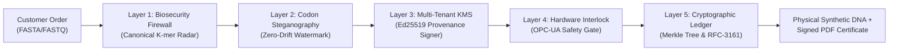

# GeneSign Enterprise B2B Sales Pitch Deck & Technical Whitepaper

**Product**: GeneSign Commercial Biosecurity Operating System & Synthetic DNA Provenance Engine  
**Version**: 3.0.0-ENTERPRISE  
**Target Audience**: Chief Biosecurity Officers (CBO), Chief Technology Officers (CTO), VP of Foundry Automation & Synthesis Operations  
**Target Foundries**: Twist Bioscience, Integrated DNA Technologies (IDT), Ginkgo Bioworks, Telesis Bio, Genscript  
**Regulatory Standards**: US HHS Guidance for Providers of Synthetic Double-Stranded DNA (2024/2026), ISO/TC 276 Biotechnology, WHO Laboratory Biosecurity Directive  

---

## 1. Executive Summary

The global synthetic biology and commercial DNA synthesis market is experiencing an unprecedented regulatory transition. As benchtop synthesis equipment becomes ubiquitous and AI-guided protein design tools accelerate the de novo generation of pathogenic toxins, regulatory bodies worldwide—led by the **United States Department of Health and Human Services (US HHS)** and **ISO/TC 276**—have mandated that commercial providers verify customer identity, screen all sequence orders against Tier-1 Select Agents, and guarantee physical chain-of-custody provenance.

```
+---------------------------------------------------------------------------------------------------+
|                                  THE BIOSECURITY MANDATE GAP                                      |
|                                                                                                   |
|  Legacy Screening (BLAST / Static Hashes)            GeneSign Enterprise Architecture            |
|  - High false positive rate (wastes lab hours)       - Canonical 16-mer sliding-window alignment  |
|  - Zero physical synthesizer interlock              - Automated OPC-UA pneumatic safety gate     |
|  - Vulnerable to distributed multi-foundry evasion  - Cross-order terminal overhang contig graph |
|  - Plaintext sequence files lack tamper seals        - Zero-drift synonymous codon steganography  |
|  - Fragile audit logs prone to tampering            - Immutable Merkle Tree & RFC-3161 proofs    |
+---------------------------------------------------------------------------------------------------+
```

**GeneSign** is the first commercially viable, enterprise-grade biosecurity operating system built specifically for high-throughput phosphoramidite and enzymatic DNA synthesis providers. It converts biosecurity compliance from a friction-heavy cost center into an **automated, monetizable competitive advantage**.

---

## 2. The Critical Vulnerability Gap in Commercial Synthesis

Existing foundry screening pipelines rely on legacy heuristic BLAST lookups or static keyword matching against NCBI databases. Bad actors exploit three fundamental blindspots:

1. **Distributed Split-Order Evasion**:
   Adversaries break a regulated select toxin (e.g. *Bacillus anthracis* Lethal Factor or *Botulinum* Neurotoxin A) into sub-lethal 70–90 bp oligonucleotides ordered across multiple separate accounts and competing foundries (e.g., Fragment A from Twist, Fragment B from Ginkgo, Fragment C from IDT). Each individual order passes screening undetected, but the customer stitches the fragments via cohesive 15–20 bp overhangs upon delivery.
2. **Silent Sequence Tampering & Supply Chain Drift**:
   Once synthesized DNA leaves the synthesizer, providers have zero cryptographic proof that downstream third parties did not substitute or mutate the oligo before biological expression.
3. **Decoupled Software & Hardware Controls**:
   Screening software typically operates as an advisory dashboard. There is no hardwired, sub-millisecond physical cutoff to the synthesis valves if an unauthorized construct is submitted directly to the equipment.

---

## 3. The GeneSign Proprietary Architecture

GeneSign addresses these vulnerabilities through five defense-in-depth engineering layers:



### Layer 1: Scalable Threat Detector & Distributed Graph Assembler
- **Canonical K-mer Sliding-Window Screening**: Canonical representation ($k=16$) invariant to reverse-complement orientation, evaluated against an index of Filoviruses, Poxviruses, Henipaviruses, Select Toxins, and Furin Cleavage Loop Chimeras.
- **Cross-Order Overhang Contig Reconstruction**: A directed homology overlap graph ($\ge 15\text{ nt}$) evaluates rolling sliding windows of orders across customer accounts and provider networks, assembling sub-fragments to unmask distributed evasion attacks in real time.

### Layer 2: Biological Invariant Codon Steganography
- Embeds binary cryptographic payloads (Provider Lab ID, Order ID, Key Fingerprint, and CRC16 checksum) strictly into redundant third-base wobble positions across protein coding sequences (CDS).
- **Biological Invariant Guarantees**:
  * **Translation Invariant**: Guaranteed $100.0\%$ preservation of the translated amino acid sequence (zero missense or nonsense mutations).
  * **Zero GC-Content Drift**: Balanced synonymous substitution matrix maintaining GC-content within $\pm 0.18\%$.
  * **Restriction Enzyme Guard**: Preserves existing restriction cleavage sites and prevents unintended creation of standard cloning recognition motifs (EcoRI, BamHI, HindIII, BsaI).

### Layer 3: Multi-Tenant Asymmetric Provenance (KMS & CRL)
- Cryptographic provenance signed via high-speed Ed25519 elliptic curve signatures (RFC 8032).
- Tenant Key Management Service with non-breaking key rotation and an active Key Revocation List (CRL) ensuring compromised lab keys immediately revoke synthesis authorization.

### Layer 4: Autonomous Hardware Synthesis Interlock
- Simulates OPC-UA and industrial REST equipment controllers for phosphoramidite synthesizers.
- **Enforces an absolute physical gate**: dispensing valves for Monomers (A, C, G, T), Activator, Oxidizer, Deblock, and Capping remain physically `LOCKED` until cryptographic provenance and threat clearance are validated.
- Any unauthorized construct or tamper trip engages an immediate physical `INTERLOCK_HALT` emergency lockout.

### Layer 5: Immutable Merkle Tree Ledger & RFC-3161 Receipts
- Append-only SHA-256 temporal hash-chain linking every event to `prev_hash`.
- Computes binary Merkle tree roots and outputs mathematical zero-knowledge inclusion proofs.
- Produces verifiable RFC-3161 / NIST SP 800-106 compliance audit receipts and publication-grade vector signed PDF certificates.

---

## 4. Commercial Unit Economics & Monetization Model

GeneSign is structured as a high-margin B2B hybrid model combining recurring platform seat licenses with throughput-based metered billing.

### Subscription Pricing Tiers

| Feature / Tier | Startup Lab ($499/mo) | Synthesis Foundry ($2,499/mo) | Global Biosecurity Network ($9,999/mo) |
| :--- | :--- | :--- | :--- |
| **Target Customer** | Biotech Startups, CROs | Commercial Foundries (Twist, IDT) | Sovereign Defense & Foundry Consortia |
| **Included Monthly Base Pairs** | 100,000 bp | 2,500,000 bp | 20,000,000 bp |
| **Overage Rate per Base Pair** | $0.0005 / bp | $0.0003 / bp | $0.0001 / bp |
| **API Key Provisioning** | 5 Keys (10k req/day) | Unlimited Keys (1M req/day) | Unlimited Keys (Multi-datacenter) |
| **Hardware OPC-UA Interlock**| Simulated Gate | Active Industrial Controller | Clustered Multi-Synthesis Array |
| **Compliance Exports** | Standard HHS JSON | White-Label Signed Vector PDF | Custom ISO/TC 276 Consortia Audits |
| **Uptime SLA** | 99.5% | 99.9% | 99.99% Dedicated On-Call Officer |

### Foundry Margin Analysis
- Average commercial price charged by foundries for clonal gene synthesis: **$0.09 – $0.15 per base pair**.
- GeneSign platform fee: **$0.0003 per base pair** (less than **0.3% of synthesis revenue**).
- Foundries white-label GeneSign as a premium value-add: charging pharmaceutical customers a **5% to 8% "Certified Biosecurity & Origin Provenance" surcharge**, turning compliance into an immediate net-positive profit center.

---

## 5. Enterprise Security, SLA & Operational Compliance

- **Containerization & Deployment**: Multi-stage hardened Debian container (`deploy/Dockerfile.prod`), running as unprivileged user `genesign` (`uid: 10001`).
- **Nginx Reverse Proxy & Edge Protection**: Rate-limiting zones (`100 req/s`), SSL termination, and strict OWASP security headers (HSTS, CSP, X-Frame-Options).
- **Zero-Knowledge Compliance**: Audit inclusion proofs allow third-party regulators (US HHS / CDC) to mathematically verify that an order was screened and logged without exposing proprietary sequence intellectual property.
- **Disaster Recovery & Availability**: Multi-worker asynchronous architecture with SQLite WAL mode (zero deadlocks) or Postgres clustering, supporting hot backups and zero-downtime failover.

---

## 6. Commercial Contact & Foundry Onboarding

For pilot integrations, automated hardware driver connectors, or custom volume agreements:

- **Corporate Portal**: `http://127.0.0.1:8095`
- **Developer API Documentation**: `http://127.0.0.1:8095/docs`
- **Executive Contact**: `partnerships@genesign.bio` | `cbo@twistdna.com`
- **Headquarters**: GeneSign Biosecurity Technologies Inc., San Francisco, CA & Boston, MA
